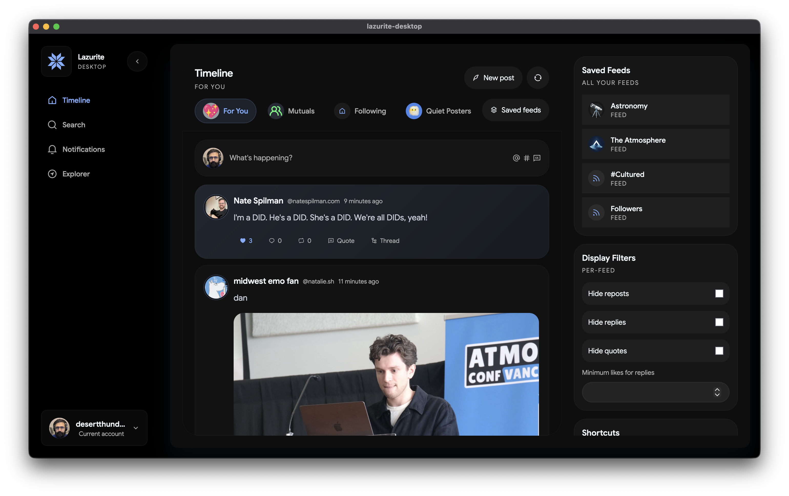

# Lazurite (for Desktop)

Lazurite is a power-tool for BlueSky that gives you everything you need to manage your account, explore the AT Protocol, and stay on top of your feeds.

This app is the "successor" to [bsky-browser](https://tangled.org/did:plc:xg2vq45muivyy3xwatcehspu/skybidi) and companion to [Lazurite for Mobile](https://github.com/stormlightlabs/lazurite).

## Features

- Account switching
- Multicolumn views
- Read standard.site posts for a handle (coming soon!)
- View all of your feeds, starter packs, and lists
- Search all your saved and liked posts
- PDS browser
- Profile Context (Blocked, Blocked By, etc.)
- Lists & Starter Packs
- Optional local-first Semantic Search for your saved and liked posts
- Keyboard shortcuts for everything (seriously) ↓

## Keyboard Shortcuts

| Area                  | Action                                         | Shortcut                     |
| --------------------- | ---------------------------------------------- | ---------------------------- |
| Global                | Open settings (outside text inputs)            | `,`                          |
| Global                | Open composer from anywhere                    | `Ctrl+Shift+N`               |
| Feed & Composer       | Switch pinned feeds                            | `1-9`                        |
| Feed & Composer       | Move focused post                              | `j / k`                      |
| Feed & Composer       | Like focused post                              | `l`                          |
| Feed & Composer       | Reply to focused post                          | `r`                          |
| Feed & Composer       | Repost focused post                            | `t`                          |
| Feed & Composer       | Open focused thread                            | `o / Enter`                  |
| Feed & Composer       | Open composer                                  | `n`                          |
| Feed & Composer       | Save draft (composer open)                     | `Ctrl/Cmd+S`                 |
| Feed & Composer       | Open drafts list                               | `Ctrl/Cmd+D`                 |
| Search                | Focus search input                             | `/ or Ctrl/Cmd+F`            |
| Search                | Cycle post search modes                        | `Tab`                        |
| Search                | Clear query / close profile suggestions        | `Escape`                     |
| Deck & Diagnostics    | Add deck column                                | `Ctrl/Cmd+Shift+N`           |
| Deck & Diagnostics    | Close last deck column                         | `Ctrl/Cmd+Shift+W`           |
| Deck & Diagnostics    | Switch diagnostics tabs                        | `1-5`                        |
| Deck & Diagnostics    | Close diagnostics view                         | `Escape`                     |
| Explorer              | Focus explorer input                           | `Ctrl/Cmd+L`                 |
| Explorer              | Navigate up one level                          | `Backspace`                  |
| Explorer              | Back / forward                                 | `Ctrl/Cmd+[ or Ctrl/Cmd+]`   |
| Messaging & Overlays  | Send message                                   | `Enter`                      |
| Messaging & Overlays  | Insert newline in message composer             | `Shift+Enter`                |
| Messaging & Overlays  | Close thread drawer, image gallery, and menus  | `Escape`                     |

## Stack

The frontend is made with Solid.js & Tailwind

### Rust/Tauri

- `rustqlite`/`tokio-rustqlite` & `tokio` for sqlite (FTS and vector search)
- `jacquard` for atproto client
- `fastembed` and `nomic-embed-text` for embeddings

## Inspiration

- [Aeronaut for BlueSky](https://apps.apple.com/us/app/aeronaut-for-bluesky/id6670275450) (Mac Only)
- [pds.ls](https://pds.ls)
- [cleanfollow](https://cleanfollow-bsky.pages.dev/)

## See also

Lazurite for mobile: [github](https://github.com/stormlightlabs/lazurite) | [tangled](https://tangled.org/did:plc:xg2vq45muivyy3xwatcehspu/lazurite)

## License

MIT
